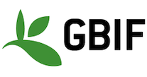

This is an email alert sending through any changes to the authoritative conservation and sensitive lists.  If there are changes needed to the lists or something looks wrong, please email [Amanda](mailto:amanda.buyan@csiro.au) and she will regenerate the lists and email.

Note: the new lists have been uploaded to the test environment; please check the lists there.

<u>Conservation:</u>

CONSERVATION_LIST_OF_CHANGES

<u>Sensitive:</u>

SENSITIVE_LIST_OF_CHANGES

---

THIS EMAIL IS FOR INTERNAL USE BY THE ALA ONLY.  If you have received this email in error, please notify us at [support@ala.org.au](mailto:support@ala.org.au) and we will remove you from this mailing list. 

This email was generated by the ALA using Python at TIME (ACDT) on DATE.

<b>The ALA is made possible by contributions from its partners, is supported by <a href="https://www.education.gov.au/national-collaborative-research-infrastructure-strategy-ncris">NCRIS</a>, is hosted by <a href="https://csiro.au/">CSIRO</a>, and is the Australian node of <a href="https://www.gbif.org/en/">GBIF</a>.</b>

<h4>Acknowledgement of Traditional Owners and Country</h3>

The Atlas of Living Australia acknowledges Australia’s Traditional Owners and pays respect to the past and present Elders of the nation’s Aboriginal and Torres Strait Islander communities. We honour and celebrate the spiritual, cultural and customary connections of Traditional Owners to country and the biodiversity that forms part of that country.