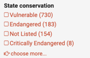
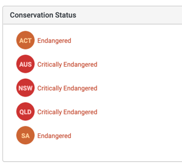

# Conservation Lists - Templates

## Background
[Conservation lists](https://lists.ala.org.au/public/speciesLists?listType=eq:CONSERVATION_LIST&isAuthoritative=eq:true) are ingested into the ALA's lists tool for each state according to their legislated threatened species, plus the national EPBC threatened species list.

**What does the ALA do with them?**

We ingest the lists into our Lists tool. Each item on the lists is passed through our name matching algorithm.  

When species occurrence data is ingested into the ALA, we do a lot of processing to check location coordinates and parse the species information again through our name matching algorithm. 
We then use the Australian state of the location and the matched species to look up these lists and populate the ALA field `stateConservation`. This indexed field can be used in a search via our webapp:

Or we can use the field `conservationStatus` in query parameters, for example:
[https://biocache.ala.org.au/occurrences/search?q=state%3AQueensland&fq=**state_conservation:Critically+Endangered**%22](https://biocache.ala.org.au/occurrences/search?q=state%3AQueensland&fq=state_conservation%3A%22Critically+Endangered%22)

We also use this information on our species pages, for example, the [Regent Honeyeater species page](https://bie.ala.org.au/species/urn:lsid:biodiversity.org.au:afd.taxon:83225d29-264f-4236-9dda-32f7d60fb3af) lists the status for each state

## Recommended fields

A template csv can be found here: [stateConservationListTemplate.csv](stateConservationListTemplate.csv)

The minimum mandatory fields are marked below with an asterisk. However, the provided lists should contain as much taxonomic information as possible, so that the name matching algorithm can find the best match. The below list contains the relevant Darwin Core terms that may be used by the algorithm.

Conservation lists contain the fields `status` and `sourceStatus`, the former usually representing a final parsed IUCN like vocabulary to enable faceting which is reasonably consistent between states, and the latter containing the raw values provided by the state jurisdiction.

Additional fields can be provided and will be retained with the list.

| Field Name               | Darwin Core Uri | Darwin Core definition|
|--------------------------|-----------------|-----------------------|
| *scientificName          |     |     |
| vernacularName           |     |     |
| acceptedNameUsage        |     |     |
| taxonomicStatus          |     |     |
| taxonRank                |     |     |
| nomenclaturalCode        |     |     |
| kingdom                  |     |     |
| phylum                   |     |     |
| class                    |     |     |
| order                    |     |     |
| family                   |     |     |
| scientificNameAuthorship |     |     |
| taxonRemarks             |     |     |
| sourceStatus             |     |     |
| *status                  |     |     |